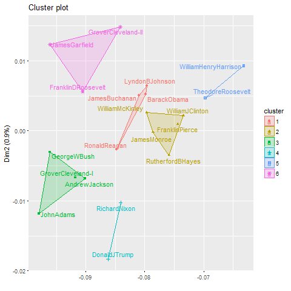

# Fall 2017
# Project 1: What did the presidents say at their inauguation?

##Project Description
This is the first and only *individual* (as opposed to *team*) this semester. 

Term: Fall 2017

+ Projec title: The difference and similarity bewteen extroverted and introverted personality dominated presidents. 
+ This project is conducted by Hongyang Yang, Columbia UNI: hy2500

+ Project summary: This project is to study the number of the words, the style of the speech and the positive/negative emotion used between extroverted and introverted presidents. Finally, summarize the most often used words by extroverted presidents using topic modeling.

##What words can Presidents’ personality tell us?

First, let’s calculate extroverted v.s. introverted total sentenses, total words, and average words per sentenses.

We can briefly conclude that an extroverted personality dominated president is more talkative than an introverted personality dominated president.

Second, extroverted people are usually easy to identify and compare, so let’s use Kmeans to cluster extroverted presidents’ speeches to see if any presidents have the same talking style.

I would say that Donald Trump and Richard Nixon have the same talking style, they are common in their ambition, Paranoia, and Media Distrust. They are both alpha male, have strange behavior and unwelcomed by most people.

Barack Obama and Ronald Reagan have a lot in common. Their personality are both attractive, they like to encourage people and tell jokes, their speeches are really impressive and influencial.

We notice that the sentences in inaugural speeches are longer than those in nomination acceptance speeches.

We notice that there are only one sentenses that are longer than 100 words in introverted presidents’ speeches, but there are few sentenses that are longer than 100 words in extrovered presidents’ speeches.

##What words did extroverted/introverted Presidents say?

Let’s compare some famous extroverted and introverted presidents’ words. Do you think an extroverted president is more likely to use positive emotion words, and an introverted president is more likely to use rational or negative emotion words?

Donald J Trump v.s. Thomas Jefferson

William J Clinton v.s. Abraham Lincoln

## Sentiment Analysis of Inauguration speeches
In the sentiment analysis part, we want to measure what is the proportion of the sentiment was positive or negative during the whole speech process.

We can see that Donald Trump (extroverted) has more positive words than Thomas Jefferson (introverted), and William Clinton (extroverted) has more positive words than Thomas Jefferson (Abraham Lincoln).

Compare of extroverted/introverted presidents’ emotions in general

It seems they have little difference over using the positive and negative words.

What about under some pressure like an economic recession? What are the most used terms in an economic recession?

Compare of extroverted/introverted presidents’ emotions under economic recession

 Extroverted presidents put fear before joy under economic recession. That may suggest an extroverted person like to motative or influence people when there is a pressure.
 
## Topic modeling for extroverted presidents during economic recession.
 
 
 The most common words that extroverted president used during an economic recession.

 

